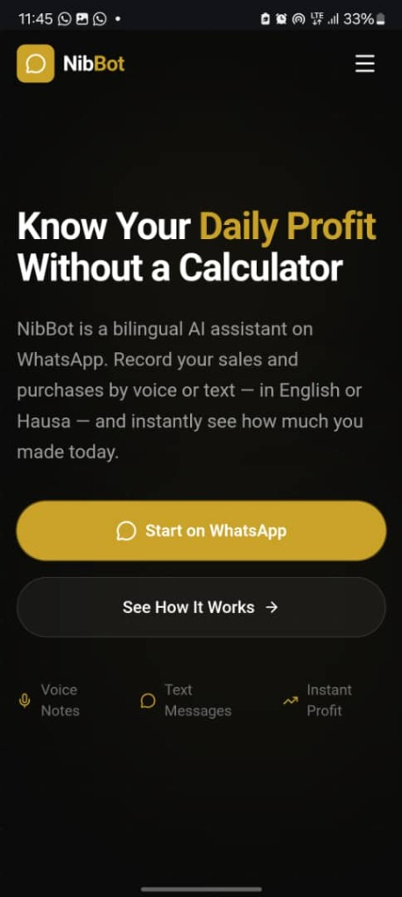
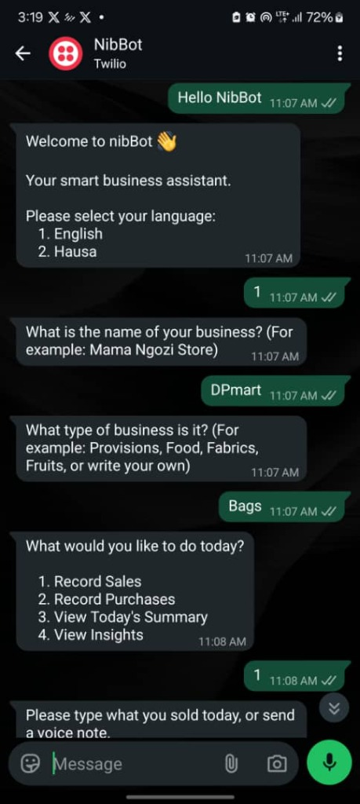

# NibBot

> One-line summary: A bilingual WhatsApp-based AI bookkeeping assistant for small business women in Nigeria that extracts transactions from voice/text and tracks daily profit without a calculator.

## HER Hackathon Track

- Track: SME Growth
- Team Name: Dexplorers
- Team Members:
  - Dorathy Paul — Team Lead & Product Developer
  - Deborah Fashida — Researcher & Designer

## Problem Statement

Small business and market women in Nigeria struggle to track their daily sales, purchases, and profits because traditional bookkeeping apps are too complex, require manual typing, and are only in English, while paper logs are easily lost or damaged. This leads to poor cash flow management, loss of business capital, and lack of records to secure micro-loans.

Evidence from validation (we spoke to 10 women retailers to understand how they manage their business finances):

- **8/10 women** couldn't confidently calculate their daily profit.
- **6/10 women** said poor financial records limited their planning, funding, or business growth.
- **5/10 women** had stopped keeping detailed records because it was too difficult to maintain.

> Note: AI helped us organize our research and refine questions, but our problem validation is based on real user research and credible sources.

## Solution Overview

NibBot helps small business women in Nigeria achieve financial clarity and track daily profits by providing a simple, voice-enabled bookkeeping assistant directly inside WhatsApp.

*Note on AI Integration: To keep prototype run costs at zero, the bot is currently running on a robust rule-based text/voice-note parser. However, the complete integration for OpenAI GPT-4o-mini and Whisper is fully coded and ready to be toggled on by adding a standard API key to the environment variables.*

Core features:

1. **Bilingual Voice & Text Logging**: Speak or type naturally in English or Hausa (tailored for users in Northern Nigeria, with plans to expand to Yoruba and Igbo).
2. **Transaction Extraction**: Automatically parses products, quantities, prices, and totals from informal conversations.
3. **Interactive Clarification & Summary**: Automatically asks follow-up questions in the chosen language if details are missing, and generates instant daily profit calculations.

## Demo

- Live Demo: https://nib-bot.vercel.app/

- Demo Video: https://drive.google.com/file/d/1V5Qhmc_77xkbwyJwDYQbWRX7YsTNmDgj/view?usp=sharing

- Pitch Deck: https://drive.google.com/file/d/1l2zt4zjh96rCLmCqxoUtEobYxQBhFAkH/view?usp=sharing

## Screenshots

| Screen | Description |
|---|---|
|  | Landing page displaying the product value proposition and WhatsApp CTAs. |
|  | WhatsApp flow showing language selection, business details collection, and main menu. |

## How It Works

1. **User sends a message**: The user sends a text or voice note on WhatsApp (in English or Hausa) detailing a sale or purchase.
2. **System processes and extracts**: NibBot transcribes the audio (if voice), extracts transaction details (using the rule-based parser for prototype testing, or GPT-4o-mini in production), asks for clarification if details are vague, and requests confirmation.
3. **Save and Summarize**: Upon confirmation, the transaction is saved. The user can request their daily profit summary or tailored business insights instantly.

## Validation & Research

Who we spoke to / researched:

- 10 target market women and retail shop owners in local markets.
- Hackathon mentors and domain experts in microfinance and retail business.
- Industry reports on mobile internet adoption and financial inclusion in Nigeria.

Key findings:

| Finding | Evidence | Product decision |
|---|---|---|
| High WhatsApp usage | 90%+ of interviewed women use WhatsApp daily but avoid downloading utility apps. | Designed the entire interface to live inside WhatsApp. |
| Language barriers | Several interviewees prefer communicating in Hausa or Pidgin over standard English. | Added full bilingual support (English & Hausa) for both text and voice. |
| Co-mingling of funds | Sellers frequently spend sales cash on personal needs without tracking. | Added automated profit calculations (Sales vs. Purchases) and business insights. |

## Tech Stack

- Frontend: Next.js (React), Tailwind CSS, Framer Motion
- Backend: Next.js API Routes, Twilio WhatsApp API
- Database: PostgreSQL (Supabase), Drizzle ORM
- AI/API Tools: OpenAI Whisper (Transcription), OpenAI GPT-4o-mini (Extraction & Insights) - *Fully implemented, currently set to rule-based parser fallback for cost*
- Deployment: Vercel

## Architecture

```text
  [User (WhatsApp)]
         ↓
  [Twilio WhatsApp Gateway]
         ↓
  [Next.js API Webhook (/api/whatsapp)]
    ↙                       ↘
[OpenAI Whisper]        [OpenAI GPT-4o-mini]
(Audio Transcription)  (Extraction & Insights)
    ↘                       ↙
  [Drizzle ORM / PostgreSQL (Supabase)]
```

## Installation / Setup

### Prerequisites

- Node.js 18+
- npm or yarn
- Supabase (PostgreSQL) Database
- Twilio account with WhatsApp Sandbox enabled
- OpenAI API Key (optional for fallback/rule-based mode, required for full AI feature set)

### Clone the repository

```bash
git clone https://github.com/your-repo/NibBot.git
cd NibBot
```

### Install dependencies

```bash
npm install
```

### Set up environment variables

Create a `.env` file in the root directory:

```env
DATABASE_URL=your_postgresql_database_url
TWILIO_ACCOUNT_SID=your_twilio_account_sid
TWILIO_AUTH_TOKEN=your_twilio_auth_token
TWILIO_PHONE_NUMBER=whatsapp:+14155238886
OPENAI_API_KEY=your_openai_api_key
NEXT_PUBLIC_WHATSAPP_NUMBER=14155238886
```

### Initialize Database

Deploy the Drizzle schema to your database:

```bash
npm run db:push
```

### Run locally

```bash
npm run dev
```

Open `http://localhost:3000` in your browser.

## Usage

1. Send "Hello NibBot" to the WhatsApp sandbox number.
2. Select your preferred language (1 for English, 2 for Hausa).
3. Enter your business name and business type to complete onboarding.
4. Record a sale or purchase by typing or sending a voice note, and confirm the extracted values to log them.

## Project Structure

```text
.
├── assets/             # Screenshots and visual media
├── drizzle/            # Database migrations and snapshots
├── src/
│   ├── app/
│   │   ├── api/        # Next.js API routes (whatsapp webhook, stories, stats, dashboard)
│   │   ├── components/ # Landing page sections
│   │   ├── dashboard/  # Business owner web portal
│   │   ├── globals.css
│   │   └── page.tsx
│   ├── db/             # Drizzle client and schema definitions
│   └── lib/            # WhatsApp bot router, Twilio, and OpenAI helpers
├── package.json
└── README.md
```

## Challenges We Faced

- **Bilingual Voice Processing**: Transcribing voice notes containing mixed English, Pidgin, and Hausa speech required custom system instructions for Whisper and fallback translation handling.
- **Parsing Informal Speech**: Building a robust system to extract items, quantities, and prices from unstructured logs (e.g. "I sold two bags of rice to Aunty Shade for 70k") required careful prompting of GPT-4o-mini to output valid structured JSON.
- **Interactive TTY Sandbox Limits**: Working within sandbox terminals limited our ability to run interactive migration generation scripts directly, which required manual schema synchronization.

## What We Would Improve Next

- **Additional Language Support**: Expand localization support beyond English and Hausa to include Yoruba and Igbo to reach business owners across all regions of Nigeria.
- **Full OpenAI Activation**: Transition from rule-based parser to the fully integrated OpenAI Whisper/GPT-4o-mini pipeline once API funding is secured.
- **Real Payment Integrations**: Replace mock subscription codes with real Paystack or Flutterwave payment gateway links for the ₦1,000/month plan.
- **Bilingual TTS (Text-to-Speech)**: Allow the bot to read back transaction confirmations and summaries via voice note for low-literacy users.
- **Offline Sync & SMS Fallback**: Extend the assistant to work over SMS for users in rural areas with poor internet connection.

## Business / Sustainability Model

- **Users/customers**: Female small-scale retail owners and market sellers in Nigeria.
- **Revenue or support model**: A monthly subscription model of ₦1,000/month following a 30-day free trial.
- **Key partners**: Microfinance banks, local market cooperatives, and POS agent networks.
- **Main costs**: OpenAI API fees (GPT-4o-mini, Whisper), Twilio API messaging charges, and cloud database hosting.

## Team Contributions

| Name | Role | Contribution |
|---|---|---|
| Dorathy Paul | Team Lead & Product Developer | Orchestrated project development, implemented Next.js API routes, WhatsApp bot conversation state machine, and Drizzle database integration. |
| Deborah Fashida | Researcher & Designer | Conducted user surveys and interviews with local market sellers to validate the problem, and designed the branding, Figma mockups, and wireframes. |

## Acknowledgements

- NITHUB, University of Lagos
- HER Hackathon mentors, facilitators, judges, and volunteers
- The local market women who shared their time and feedback for our research

## License

For hackathon/demo purposes only.
